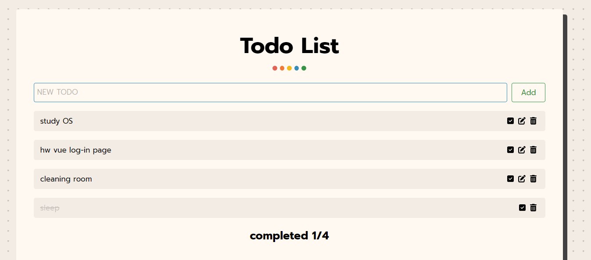

# TodoList_React

This project is todo list website using reactJS. In this website you can create, update, delete your todo list. This will help you be more productive. All data will be put on your localstorage. So, when you closing the site it will not lost.

# Additional libraries
* fontawesome for beautiful icon
* react-toastify for flash notification 
# Run project

1. install all dependencies
```npm install```

2. run website
```npm run dev```

# Example website
